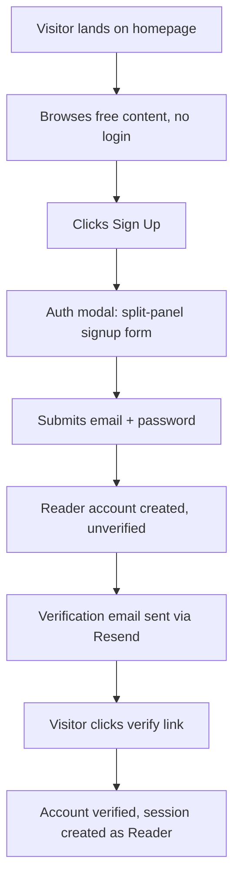
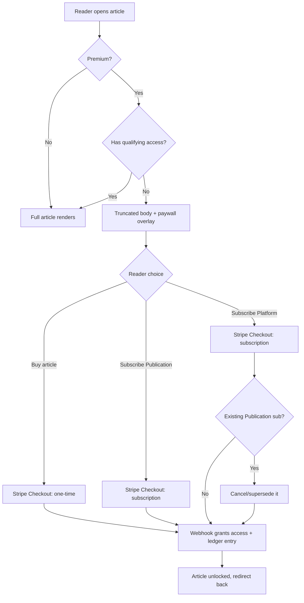
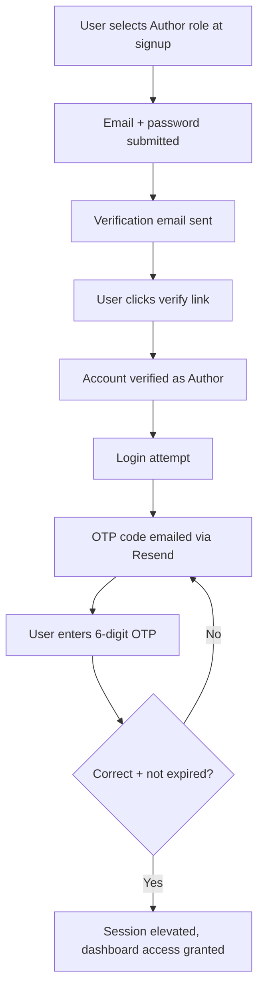
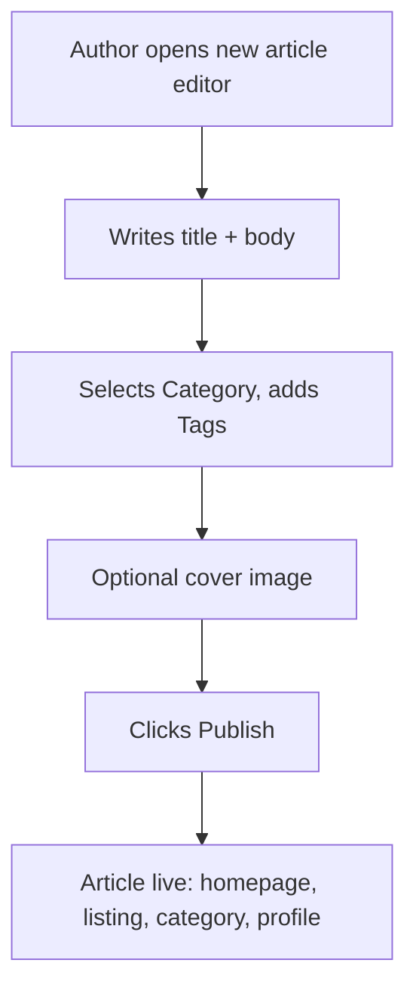
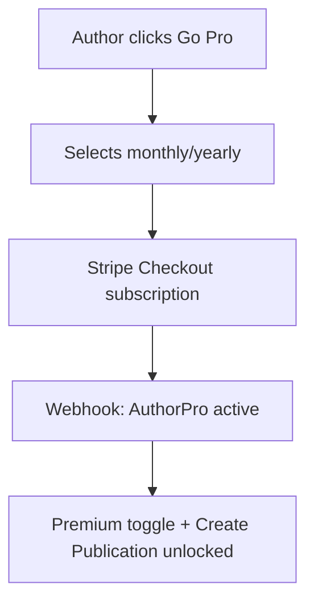
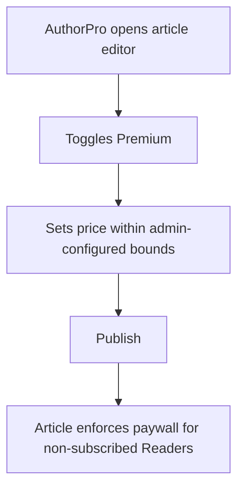
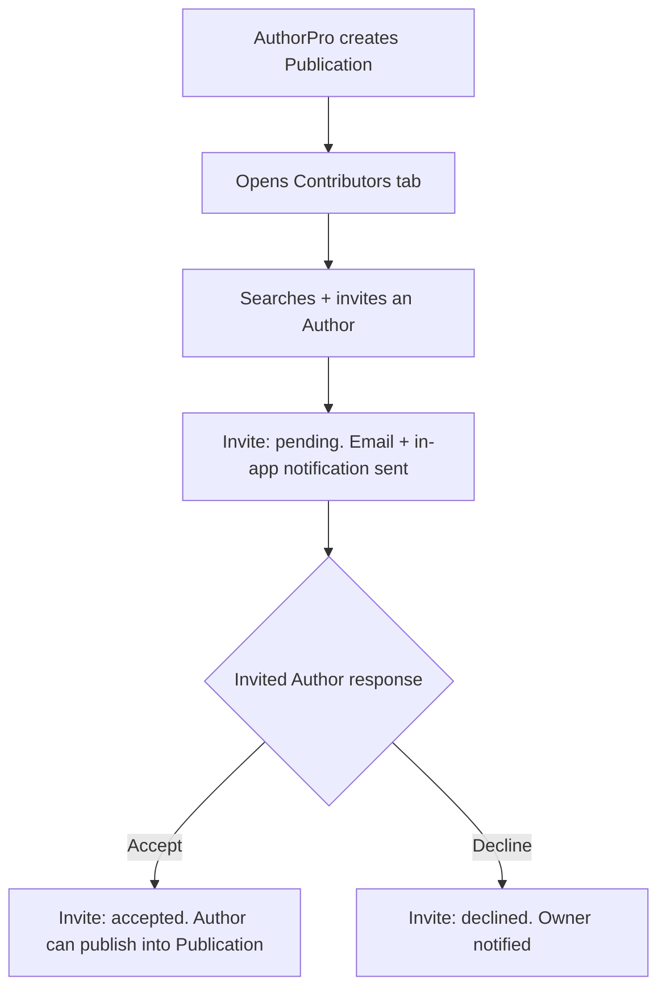
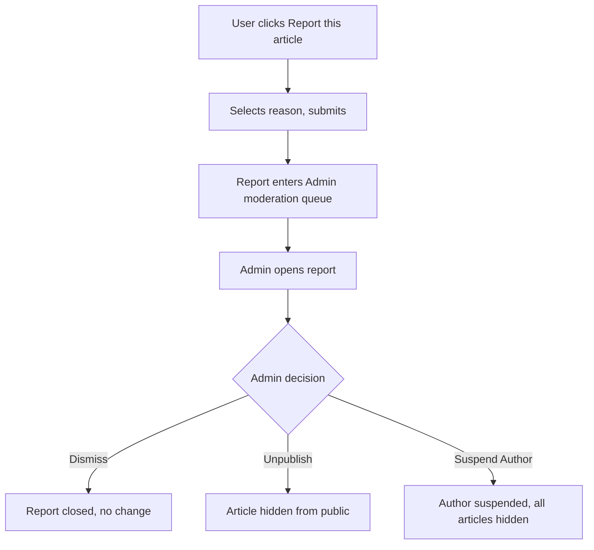
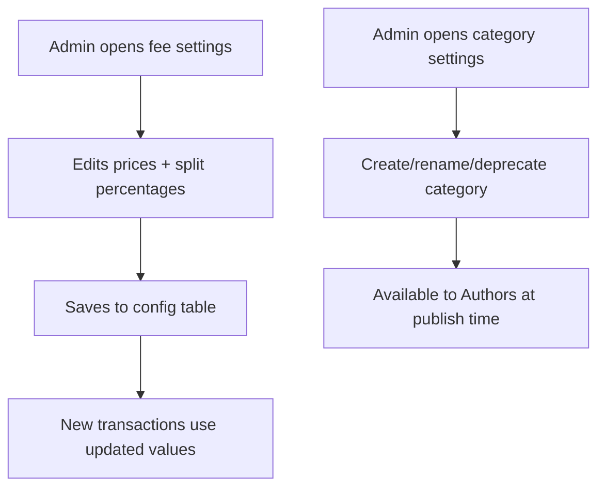
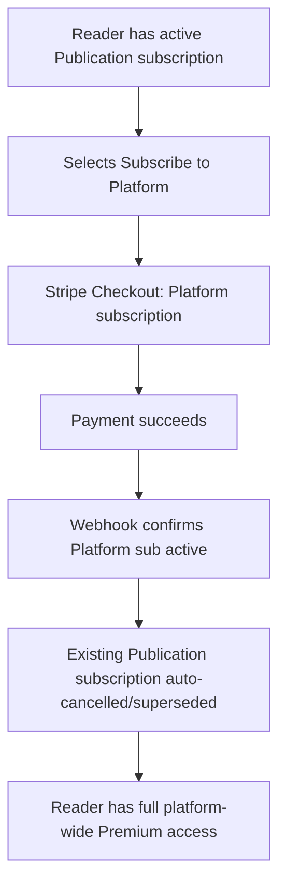

# 01 — Application Flow Map

> This document maps every role's journey through the application end-to-end. It is the reference the "whole app flow" QA prompt at the end of `04_MasterBuildGuide.md` walks against the live app, flow by flow, to confirm nothing is broken. Rules referenced here (revenue splits, permissions, subscription supersede logic) are defined in `00_ScopeDocument.md` — this file only maps the *sequence of screens and actions*, it does not restate the business rules.

---

## Flow A — Visitor → Reader signup

1. Visitor lands on the homepage (public, no auth required).
2. Visitor browses free articles, category pages, and the Content Listing page without an account.
3. Visitor clicks "Sign Up" (top nav) → auth modal opens (split-panel pattern, see `02_ThemeGuideline.md`).
4. Visitor fills Email + Password (+ optional name) on the right panel and submits.
5. System creates a Reader-role user, sends a verification email via Resend.
6. Visitor clicks the verification link → account marked verified → auto-logged in as Reader.

---

## Flow B — Reader: browse, search, read, paywall, purchase, subscribe

1. Reader logs in (or continues as verified session).
2. Reader browses homepage / Content Listing / category page, or uses the search overlay (full-screen search UI, see `02_ThemeGuideline.md`).
3. Reader opens an article.
4. If the article is **free**: full content renders immediately, read event optionally logged for analytics (not billing-relevant).
5. If the article is **Premium** and the Reader has no qualifying access (no purchase, no active Publication subscription covering it, no active Platform subscription):
   a. Article body renders truncated with a paywall overlay.
   b. Reader is shown three choices: **Buy this article** / **Subscribe to [Publication name]** (only shown if article belongs to a Publication) / **Subscribe to the Platform**.
6. Reader picks one → redirected to Stripe Checkout (one-time payment for purchase, or Subscription Checkout for either subscription option).
7. On successful payment, Stripe webhook fires → system grants access (purchase record, or subscription record) → ledger entry written per `00_ScopeDocument.md` §5.3.
8. Reader is redirected back to the article, now fully unlocked.

---

## Flow C — Author: signup, email verification, OTP 2FA

1. Visitor clicks "Become an Author" / selects Author during signup (or a Reader upgrades to Author from their profile settings).
2. Same email/password signup as Flow A, but role is set to `author` (pending verification).
3. Email verification link (Resend) — same as Flow A.
4. After email verification, system requires **OTP-based 2FA setup**: a 6-digit code is emailed to the Author (via Resend) each time they log in as an Author (or on first login to bind 2FA — Phase 1 uses email-OTP each login, not an authenticator app).
5. Author enters the OTP code → session elevated to fully-verified Author.
6. Author can now access `/dashboard/author`.

---

## Flow D — Author: writing and publishing a free article

1. Verified Author opens `/dashboard/author/articles/new` → Medium-style editor loads (see `02_ThemeGuideline.md` for editor UX spec).
2. Author writes title + body using the minimal inline-formatting editor.
3. Author selects one Category (from Admin-managed list) and adds free-form Tags.
4. Author optionally uploads a cover image.
5. Author clicks "Publish" → article status becomes `published`, visible on homepage/listing/category pages and the Author's public profile.
6. (Free-tier Author cannot toggle Premium — that control is hidden/disabled per the Role & Permission matrix in `00_ScopeDocument.md`.)

---

## Flow E — Author upgrading to AuthorPro

1. Author opens billing/upgrade page from dashboard ("Go Pro").
2. Author selects monthly or yearly AuthorPro plan.
3. Redirect to Stripe Checkout (subscription mode).
4. On success, webhook sets user's AuthorPro status active + expiry/renewal date.
5. Author dashboard now shows Premium toggle on articles and "Create Publication" action.

---

## Flow F — AuthorPro: paywalling an article

1. AuthorPro opens an article they own (new or existing draft) in the editor.
2. Author toggles "Premium" switch.
3. Price field appears (pay-per-article price; subscribers get it free via their applicable subscription).
4. Author sets price (validated against Admin-configured min/max, `00_ScopeDocument.md` §7).
5. Author publishes → article is now Premium and behaves per Flow B for Readers without access.

---

## Flow G — AuthorPro: creating a Publication + inviting a contributor + accept/decline

1. AuthorPro opens `/dashboard/author/publications/new`.
2. Enters name, description, cover image → creates Publication (Owner = self).
3. Owner opens Publication's "Contributors" tab, searches for an Author by username/email.
4. Owner sends invite → invite record created `status = pending`, email sent to invitee via Resend, in-app notification created.
5. Invited Author opens their notifications/invites list, reviews Publication name + terms.
6a. **Accept path:** invite `status = accepted` → Author can now select this Publication when publishing an article.
6b. **Decline path:** invite `status = declined` → Author gets no access; Owner is notified.

---

## Flow H — Admin: moderation (report → queue → action)

1. Any Reader/Author clicks "Report this article" on an article, selects a reason from a fixed list, submits.
2. Report record created, status `open`, enters Admin moderation queue.
3. Admin opens `/dashboard/admin/moderation`, sees queue sorted by newest/oldest, opens a report.
4. Admin reviews the article content + report reason + reporter info.
5. Admin actions one of: **Dismiss** (report closed, article untouched), **Unpublish** (article status → `unpublished`, hidden from public), **Suspend Author** (Author account status → `suspended`, all their articles hidden).
6. Action is logged (who/when/what) for audit.

---

## Flow I — Admin: fee & category configuration

1. Admin opens `/dashboard/admin/settings/fees`.
2. Admin edits: AuthorPro price (monthly/yearly), Publication subscription price, Platform subscription price, pay-per-article min/max, revenue split percentages (standalone 80/20, in-publication 60/20/20 by default — editable).
3. Admin saves → values persisted to a config table (not hardcoded), take effect for all *future* transactions (existing active subscriptions/ledger entries are not retroactively altered).
4. Separately, Admin opens `/dashboard/admin/settings/categories` to create/rename/deprecate Categories used platform-wide by Authors at publish time.

---

## Flow J — Reader: Platform subscription superseding a Publication subscription

1. Reader currently holds an active Publication subscription (e.g. subscribed to "The Wikilogy Review").
2. Reader selects "Subscribe" → chooses the Platform subscription (monthly or yearly).
3. Reader completes payment via Stripe.
4. Webhook confirms Platform subscription active → system automatically cancels/supersedes the existing Publication subscription (Stripe subscription cancelled, local record marked `superseded`, Reader is not charged again for it going forward).
5. Reader now has ad-free, unlimited access to all Premium content platform-wide, including the previously-subscribed Publication.

---

## How this doc is used later

- Every step in `04_MasterBuildGuide.md` that implements one of these flows must reference the matching Flow letter (A–J) and implement it exactly as sequenced here.
- The final "whole app flow" test-case prompt in `04_MasterBuildGuide.md` re-reads this file and manually walks Flows A through J against the deployed app, flagging any step that does not work as specified.
